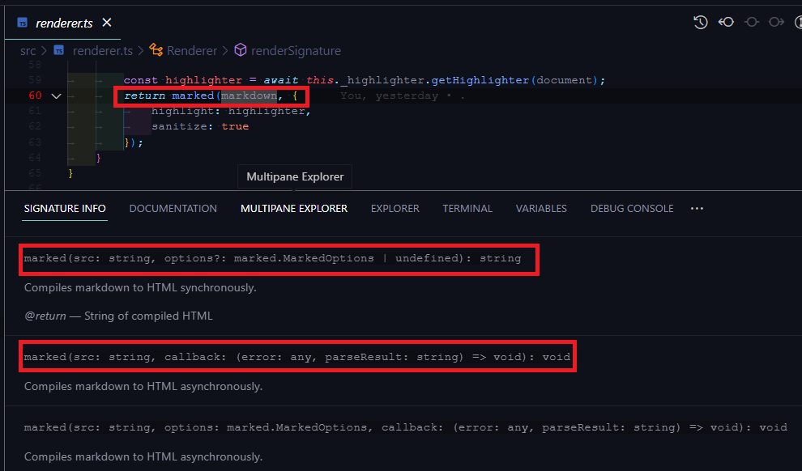

# Sigs View

VS Code extension that displays hover signatures in the sidebar or panel.

Based on [Docs View](https://marketplace.visualstudio.com/items?itemName=bierner.docs-view).

## Features

- Automatically displays signatures for the symbol at the current cursor position.
- Language independent. Works in any language that supports hovers.
- The "Signatures" view shows in the panel by default. Move to other views or the panel just by dragging.
- Supports syntax highlighting and markdown rendering in the sigs view.

## Configuration

- `sigsView.signaturesView.updateMode` : Controls how the signatures view is updated when the cursor moves. Possible values:
docsView
    - `live` : (default) The documentation always tracks the current cursor position.
    - `sticky` : The signatures tracks the current cursor position. However if there is no content at the current position, it continues showing the previous signatures.

## Commands

- `Pin current signatures` — Stop live updating of the sigs view. Keeps the currently visible signatures.
- `Unpin current signatures` — Make the sigs view start tracking the cursor again.
